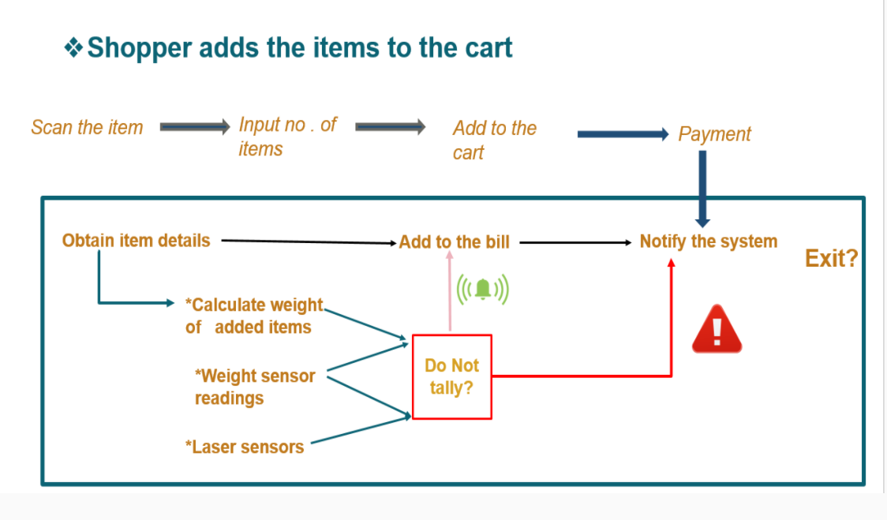

# Computer Engineering Project - Semester 5 -Third year project

## Group 11

E/16/096 – Ekanayake J.E.M.D.Y. e16096@eng.pdn.ac.lk

E/16/267 – Parackrama G.T.W. e16267@eng.pdn.ac.lk

E/16/290 – Prabodha U.A.K. e16290@eng.pdn.ac.lk

## Project definition:
Cashier takes time to billing ,so long queues at the counters in supermarkets. So that shoppers have to wait lot of time near the counter.

## Solution:
Introducing smart shopping cart with automatic bill system

## Problem:

- Cashier takes time to billing ,so long queues at the counters in supermarkets. So that shoppers have to wait lot of time near the counter.

## Target audience(buyers/users)

- Supermarket Management
- Regular shoppers

## Solution:

### Introducing _smart shopping cart with automatic bill system_

- The shopper just have to scan the item before adding it into the cart.
- This cart carries its own scanning device as a part of the cart.
- Then the billing will be done automatically.
- So that customer can pay the bill at the dedicated exit.
- Shopper can&#39;t put an item without scanning ,it will be monitered in our system.
- Shopper can remove any item ,the item will be removed from the bill also in our system

### Further into problem:

- Shopper have to read discount flyers at shop and it takes time.
- If shopper can notified about discounts before the going to supermarket both audience are benefited.
- Online-ordering system(home delivery /order before you go to supermarket then just pay and take on the way home(No delivery charges))
- Checking price list before go to the supermarket .
- Make the to-buy-list before go to the supermarket.
- Misplacement of bills (Method to save recent transactions)
- Vouchers/tokens order system.

To solve that problem we are going to introduce an _app._

### Features of our app-:

- Customer User Account
- Price lists
- To-buy lists/online ordering
- Discounts/Promotions notifications
- Recent shopping activities

## Solution Architecture :

The following diagram depicts how the major 3 sections are connected.

When designing the smart shopping cart, attention was paid to following aspects.

- Customer&#39;s convenience
- Reliable monitoring of the customer

**1)For Customer&#39;s convenience:**

- The procedure the customer has to follow is not much deviated from the traditional method used in super-markets.
- If customer forgets to scan it, he would be reminded (with the use of an alarm)
- Multiple payment methods

**2)Reliable monitoring of the customer:**

The following situations are handled using a combination of weight sensors and laser sensors.

**- customer add/remove the item to the cart without scanning:** Laser interrupted &amp; weight in the cart does not match the calculated weight in the bill

**- customer scanned the item ,but not added to the cart :** Laser interrupted &amp; weight in the cart does not match the calculated weight in the bill

Two way monitoring system (laser and weight) therefore increases the accuracy of the shopping process.

